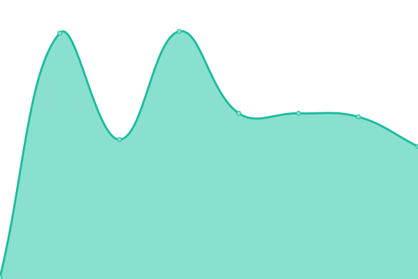

# [📈 Live Status](https://thomasdstewart.github.io/upptime/): <!--live status--> **🟩 All systems operational**

<!--start: status pages-->
<!-- This summary is generated by Upptime (https://github.com/upptime/upptime) -->
<!-- Do not edit this manually, your changes will be overwritten -->
<!-- prettier-ignore -->
| URL | Status | History | Response Time | Uptime |
| --- | ------ | ------- | ------------- | ------ |
|  [stewarts.org.uk](https://stewarts.org.uk) | 🟩 Up | [stewarts-org-uk.yml](https://github.com/thomasdstewart/upptime/commits/HEAD/history/stewarts-org-uk.yml) | 

 497ms
     
 | 

<a href="https://thomasdstewart.github.io/upptime/history/stewarts-org-uk">100.00%</a>
    

|  [wtda.org](https://wtda.org) | 🟩 Up | [wtda-org.yml](https://github.com/thomasdstewart/upptime/commits/HEAD/history/wtda-org.yml) | 

 246ms
     
 | 

<a href="https://thomasdstewart.github.io/upptime/history/wtda-org">100.00%</a>
    

|  [retrobian.org.uk](https://retrobian.org.uk) | 🟩 Up | [retrobian-org-uk.yml](https://github.com/thomasdstewart/upptime/commits/HEAD/history/retrobian-org-uk.yml) | 

 302ms
     
 | 

<a href="https://thomasdstewart.github.io/upptime/history/retrobian-org-uk">100.00%</a>
    

|  [onyx.stewarts.org.uk/smtp](onyx.stewarts.org.uk) | 🟩 Up | [onyx-stewarts-org-uk-smtp.yml](https://github.com/thomasdstewart/upptime/commits/HEAD/history/onyx-stewarts-org-uk-smtp.yml) | 

 114ms
     
 | 

<a href="https://thomasdstewart.github.io/upptime/history/onyx-stewarts-org-uk-smtp">100.00%</a>
    

<!--end: status pages-->

## 📄 License

- Powered by: [Upptime](https://github.com/upptime/upptime)
- Code: [MIT](./LICENSE) © [Upptime](https://upptime.js.org)
- Data in the `./history` directory: [Open Database License](https://opendatacommons.org/licenses/odbl/1-0/)
